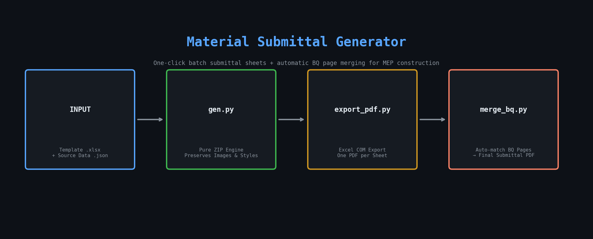

# Material Submittal Generator

> One-click batch generation of material submittal sheets + automatic BQ page merging — for MEP construction projects.

<p align="center">
  
</p>

[](LICENSE)
[](https://www.python.org/)

---

## What Problem Does This Solve?

In MEP (Mechanical, Electrical, Plumbing) construction projects, every material delivered to site requires a **material submittal form** — a formatted Excel sheet with product photos, brand info, quantities, and approval fields. Engineers typically spend **hours manually copy-pasting** data into templates, one item at a time.

This tool automates the entire pipeline:

```
Template .xlsx  +  Source Data  →  Multi-Sheet Excel  →  Per-Sheet PDFs  →  Merge with BQ pages
```

---

## Features

- **Batch generate** 50+ submittal sheets from one template and one data source
- **Preserves everything** — images, print settings, cell styles (centering, fonts, fills)
- **Pure ZIP engine** — no openpyxl `copy_worksheet()` quirks, no broken images
- **Auto BQ merging** — automatically matches and appends Bill of Quantities pages to each PDF
- **Template inspector** — diagnose any .xlsx template: find placeholders, cell positions, style indexes

---

## Quick Start

### 1. Inspect your template

```bash
python inspect.py "submittal_template.xlsx"
```

This shows all `{placeholders}`, their cell locations, and style indexes.

### 2. Create a config file

```json
{
  "template": "submittal_template.xlsx",
  "output": "output.xlsx",
  "fields": {
    "{编号}": "ref_no",
    "{材料}": "material",
    "{品牌}": "brand",
    "{数量}": "quantity"
  },
  "data": [
    {"ref_no": "MAT-001", "material": "Distribution Board", "brand": "Schneider", "quantity": "5"},
    {"ref_no": "MAT-002", "material": "Cable Tray", "brand": "OBO Bettermann", "quantity": "120m"}
  ]
}
```

### 3. Generate

```bash
python gen.py config.json
```

Output: a multi-sheet `.xlsx` with one sheet per data row — all images and styles intact.

### 4. Export to PDF (optional)

```bash
python export_pdf.py output.xlsx ./pdfs/
```

Requires: Windows + Microsoft Excel.

### 5. Merge with BQ pages (optional)

```bash
python merge_bq.py \
  --zongbiao "master_list.xlsx" \
  --bq "BQ_tender.pdf" \
  --input "./pdfs/" \
  --output "./final_output/"
```

Output: `MAT-001 Cable Tray.pdf` (page 1 = submittal form, page 2+ = corresponding BQ pages).

---

## Scripts

| Script | Purpose | Dependencies |
|:---|:---|:---|
| `inspect.py` | Diagnose template structure (placeholders, styles, images) | Standard library |
| `gen.py` | Batch-generate multi-sheet Excel from template + data | Standard library |
| `export_pdf.py` | Export each sheet to a separate PDF | pywin32, Windows + Excel |
| `merge_bq.py` | Merge submittal PDFs with corresponding BQ pages | openpyxl, PyMuPDF |

---

## Why a ZIP Engine Instead of openpyxl?

openpyxl's `copy_worksheet()` and `save()` operations:
- Drop `printerSettings.bin` (print settings)
- Break DrawingML links (images disappear)
- Corrupt `workbook.xml.rels` rId mappings

Our ZIP engine reads the `.xlsx` as a raw ZIP, manipulates the XML directly, and writes back — preserving every binary resource and style definition.

---

## BQ Page Merging

The `merge_bq.py` script:
1. Reads the master tracking Excel to get `(ref_no, BQ_ref, material_name)` mappings
2. Scans the BQ tender PDF with regex to build `{BQ_ref → page_number}` index
3. Merges each submittal PDF with its corresponding BQ page(s)

**Requirements for BQ PDF:**
- Must have a **text layer** (generated from Word/Excel, not scanned images)
- BQ reference numbers must be regex-matchable (e.g., `1.1`, `2.3.1`, `5.10-a`)

For scanned BQ PDFs, use OCR (pytesseract) or provide a manual page mapping.

---

## Installation

```bash
# Core (gen.py + inspect.py): zero dependencies — Python standard library only
python gen.py config.json

# export_pdf.py
pip install pywin32

# merge_bq.py
pip install openpyxl PyMuPDF
```

---

## Real-World Usage

This tool was built from real MEP construction workflows. A typical use case:

- **Project scale**: 30–150 material items requiring individual submittal sheets
- **Before**: 2–4 hours of manual copy-paste per batch
- **After**: 5 minutes to write config → run gen.py → done

See `docs/WORKFLOW.md` for detailed step-by-step guide and troubleshooting.

---

## License

MIT — see [LICENSE](LICENSE).

---

## Author

Mike — MEP Project Manager, Macau SAR, China.
